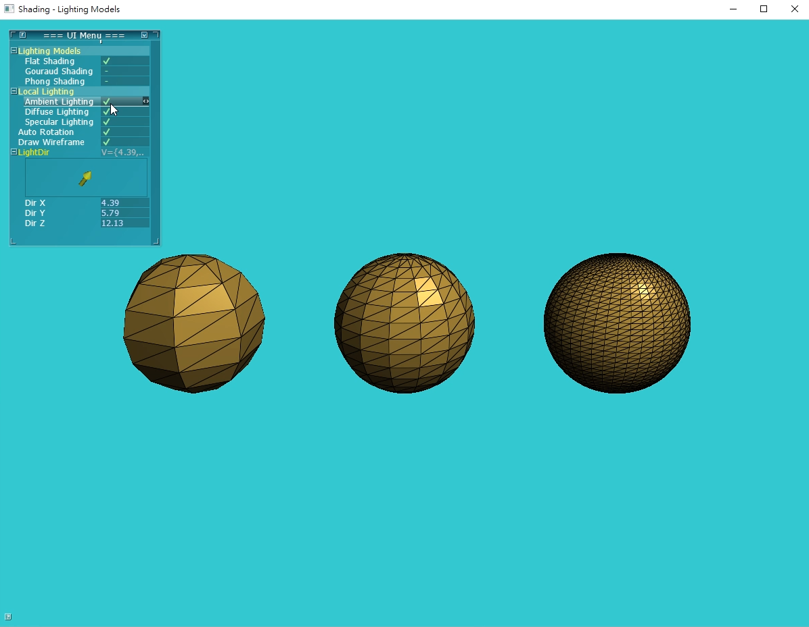
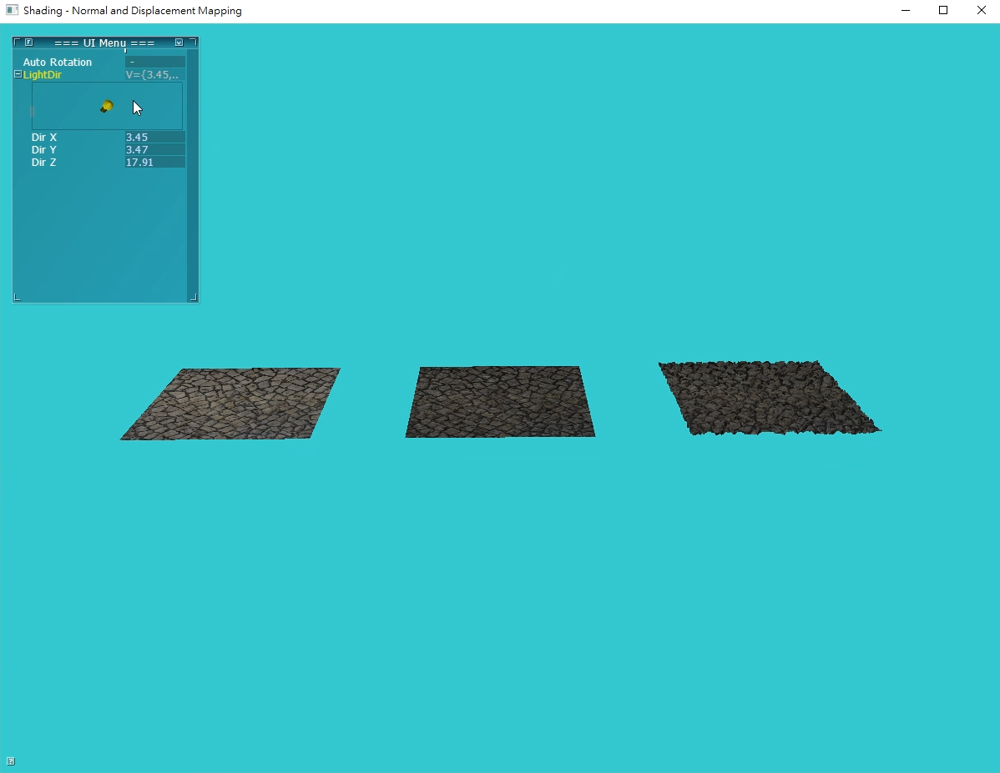
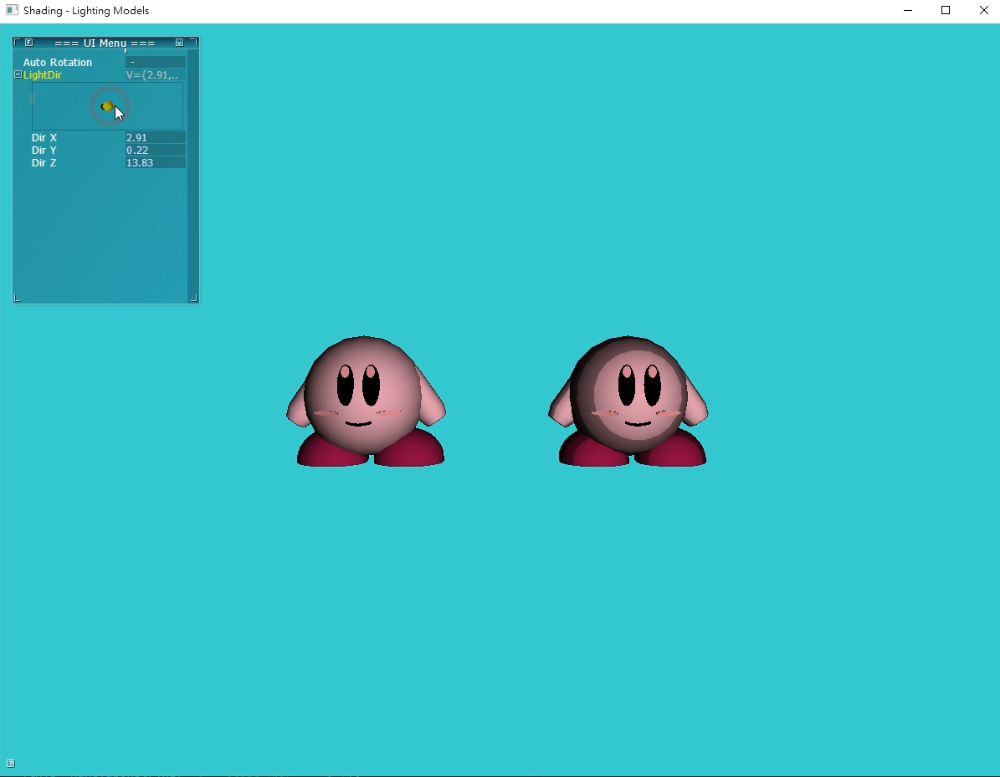

# ShaderBook-Shading
---
## Introduction
This is a book that talked about OpenGL 4.x.
I was writing Chapter10 (It's about local illumination model, normal mapping, displacement mapping, and materials parameters (e.g, ka, kd, ks).) and Chapter 13(It's about toon shading.). Both of them are include the example code, code explaination, and images.

### Shading Model
It's an example in Shader books.
This can tells about Flat shading, Gouraud Shading, and Phong Shading in different faces of circles.
You can see the light that effects on the models.

### Normal Mapping and Displacement Mapping
It's an example in Shader books.
It shows the different from normal mapping, and displacement mapping effect on the model.
With this technology, we can generate a complex model to make sure the model look real. 

The screenshot of the execution file 

### Toon Shading
It's an example in Shader books. It shows how toon shading effects to the models, and this model is made in Maya.

## Precondition
* VS2015(x86).

## VideoLink
1. [Shading Model](https://youtu.be/69bhIAFV5GQ)
2. [Normal Mapping and Displacement Mapping](https://youtu.be/44PPpQIT7sw)
3. [Toon Shading](https://youtu.be/w2ivtbvvOM0)
